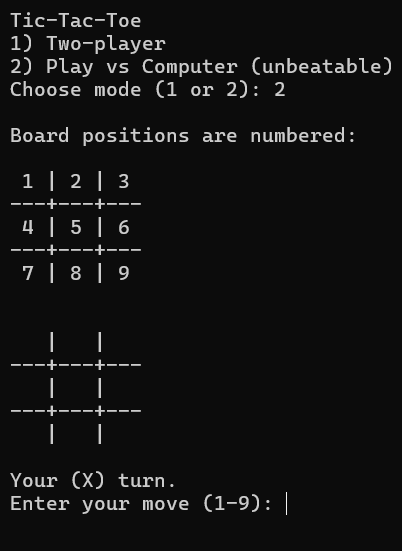
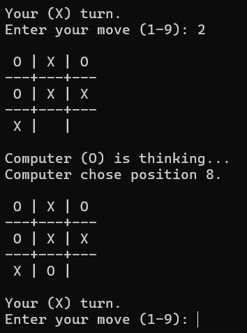

# 🎮 Tic Tac Toe in C++

A simple **Tic-Tac-Toe game** written in C++ with two modes:
- **Two Player Mode** (play with a friend)
- **Vs Computer Mode** (unbeatable AI using Minimax algorithm)

---

## 🖼️ Screenshot

  
  

---

## 🚀 Features
- Classic 3x3 Tic Tac Toe.
- Play against another player or an **AI that never loses**.
- Input validation (no invalid or already taken moves).
- Fun emojis 🎉

---
